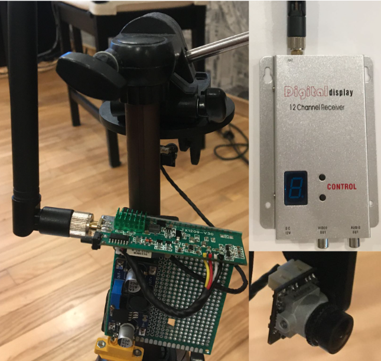
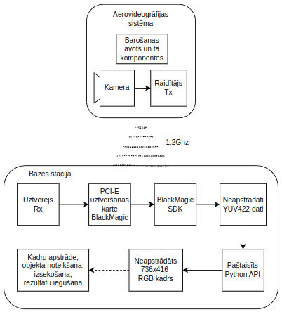
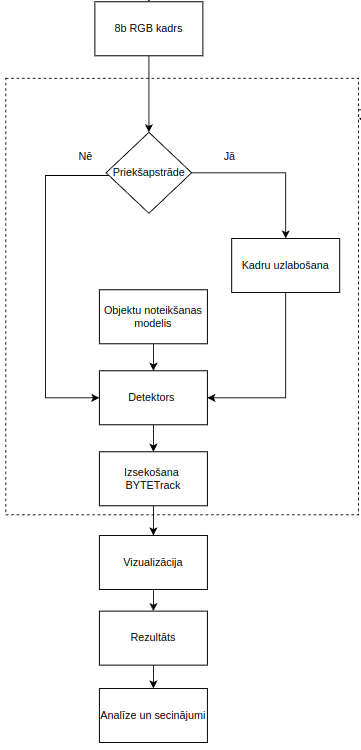

This repository is made to overview technologies and results from "Smart Computer Technologies" Bachelors thesis

# Real-time aero-videography object tracking using a base statioin

## Electrical components
* CADDDX PAL camera (756x416)
* Generic TX/RX 1.2Ghz pair for video transmission
* Power source (DC-DC converter, Li-Po RC battery)
* Base station - Intel i5-3770 and Nvidia GTX1660 6GB + Black Magic Design Intensity Pro

## Used methods
* Cascade-RCNN
* YOLOX-M
* BYTETrack
* OpenCV (CPU) image denoising
* CUDA
* Raw video capture using PCI-E capture card C/C++ sdk
* Shared memory Python for asyncronous frame reading
* OpenGL for visualisation
## Working example  

https://github.com/user-attachments/assets/3cbfc4b9-5b08-4376-83fb-6a6ec9037e73

## Implementation
This shows The TX/RX pair 

This shows the image processing, detection and tracking

## Object detection and tracking
Object tracking was divided into 2 parts - detectiond and tracking - due to modularity.
### Object detectors
 Object *detection* was done using **YOLOX-M** and **Cascade-RCNN-FPN** methods. Training, configuration and deployment was achieved with **OpenMMLabs MMDetection, MMDeploy** frameworks. 
### Object tracking 
Object tracking was done using **BYTETrack** algorithm, because it does not rely on machine learning - so modular implementation with different object detectors is possible on the fly. 
### Training 
For training **VisDroneDET2019** dataset was used due to its clear and large size images of drone - arial videography. Because of the low resolution of CADDX PAL format camera, the dataset resolution was lowered, also increasing performance of object detection due to less steps in image preprocessing. Training was done on AWS instance with NVIDIA A10G
### Deployment
The model was converted to .trt INT8 for use with **CUDA** and NVIDIA GTX1660
### Frame preprocessing
Because the video signal can experience transmission artefacts, noise etc. OpenCV image denoising methods and SRCNN (Super Resolution) was used.
### Results
The best results were using only Bilinear interpolation on the video frames. Each frame on average took 45.3 ms for Cascade-RCNN INT8 quantised model and achieved acceptable multi-object tracking. 
The most important result here is that using a base station it is possible to use large and more complex object detection and tracking methods to achieve RT performance and due to modular excution it can be used on ANY system that supports PAL video transmission

## Future improvements and usage
* Because of the limited access to use UAV flight in city limits, the video was taken from top of a building, which would simulate 30m altitde stabilized drone flight, but ofcourse using real drone would be preferable. 
* Model training - for optimised model learning would improve object detection and thus tracking results
* Improvements in base-station components
* For use in UAVs single object tracking using only regions around the object, not the whole frame
